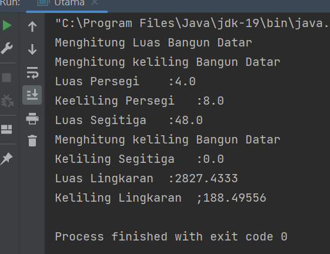

# PRAKTIKUM-4
## Pemrograman Orientasi Objek

'''sh
Nama   : Ikram Ramadhan
Nim    : 312110478
Matkul : Pemrograman Orientasi Objek
'''


### 1. File BangunDatar.java
* *CODINGAN FILE 1

```java
package TugasPraktikum4;
public class BangunDatar {
float luas(){
System.out.println("Menghitung Luas Bangun Datar");
return 0;
}
float keliling(){
System.out.println("Menghitung keliling Bangun Datar");
return 0;
}
}
```


  


### 2.Persegi.java
* *CODINGAN FILE 2
```java
package TugasPraktikum4;

public class Persegi extends BangunDatar{
    //membuat variabel BangunDatar
        int sisi;
        public Persegi (int sisi){
            this.sisi = sisi;
        }
        @Override
    public float luas (){
    return this.sisi = this.sisi;

        }
        @Override
    public float keliling (){
    return this.sisi +4;
        }

}

package TugasPraktikum4;

public class Persegi extends BangunDatar{
    //membuat variabel BangunDatar
        int sisi;
        public Persegi (int sisi){
            this.sisi = sisi;
        }
        @Override
    public float luas (){
    return this.sisi = this.sisi;

        }
        @Override
    public float keliling (){
    return this.sisi +4;
        }

}
`
package TugasPraktikum4;

public class Persegi extends BangunDatar{
    //membuat variabel BangunDatar
        int sisi;
        public Persegi (int sisi){
            this.sisi = sisi;
        }
        @Override
    public float luas (){
    return this.sisi = this.sisi;

        }
        @Override
    public float keliling (){
    return this.sisi +4;
        }

}

package TugasPraktikum4;

public class Persegi extends BangunDatar{
    //membuat variabel BangunDatar
        int sisi;
        public Persegi (int sisi){
            this.sisi = sisi;
        }
        @Override
    public float luas (){
    return this.sisi = this.sisi;

        }
        @Override
    public float keliling (){
    return this.sisi +4;
        }

}

package TugasPraktikum4;

public class Persegi extends BangunDatar{
    //membuat variabel BangunDatar
        int sisi;
        public Persegi (int sisi){
            this.sisi = sisi;
        }
        @Override
    public float luas (){
    return this.sisi = this.sisi;

        }
        @Override
    public float keliling (){
    return this.sisi +4;
        }

}
```
### 3.Lingkaran.java  
* *CODINGAN FILE 3 
```java
package TugasPraktikum4;

public class Lingkaran extends BangunDatar{
    //membuata bangun datar Lingkaran
    int r;

    public Lingkaran(int r){
        this.r = r;

    }
    @Override
    public float luas (){
        return (float) (Math.PI * r *r);
    }
    @Override
    public float keliling(){
        return (float) (2 * Math.PI * r);
    }
}
```
### 4.Lingkaran.java
* *CODINGAN FILE 4
```java
package TugasPraktikum4;

public class Segitiga extends BangunDatar{
    //membuat variabel
    int alas;
    int tinggi;

    public Segitiga (int alas,int tinggi){
        this.alas = alas;
        this.tinggi = tinggi;
    }
        @Override
    public float luas(){
        return this.alas * this.tinggi;
        }
}
```
### 5.utama.java
* *CODINGAN FILE 5
```java
package TugasPraktikum4;

public class Utama {
    public static void main(String[] args) {
        //objek bangunDatar,Persegi,Segitiga dan Lingkaran
        BangunDatar bangunDatar = new BangunDatar();
        //memasukan nilai parameter sisi
        Persegi persegi = new Persegi(4);
        //memasukan nilai parameter alas dan tinggi
        Segitiga segitiga = new Segitiga(8,6);
        //memasukan nilai parameter jari pada lingkaran
        Lingkaran lingkaran = new  Lingkaran(30);

        //memanggil method
        bangunDatar.luas();
        bangunDatar.keliling();
        System.out.println("Luas Persegi\t:" + persegi.luas());
        System.out.println("Keeliling Persegi\t:" + persegi.keliling());
        System.out.println("Luas Segitiga\t:" + segitiga.luas());
        System.out.println("Keliling Segitiga\t:" +segitiga.keliling());
        System.out.println("Luas Lingkaran\t:" + lingkaran.luas());
        System.out.println("Keliling Lingkaran\t;"+ lingkaran.keliling());

    }
}
```
* *Hasil output program:*
